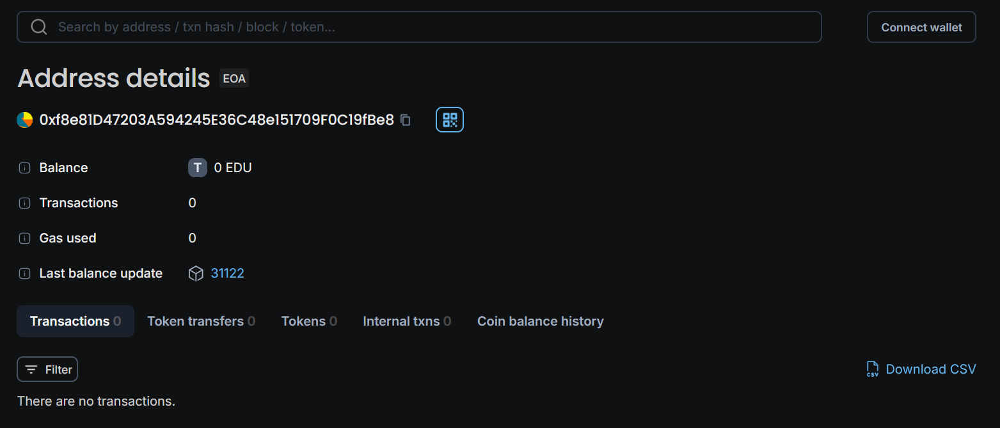

# Paper Chain: Decentralized Research Publishing

## Vision

Decentralized Research Publishing is a blockchain-based platform designed to revolutionize the way research papers are published and reviewed. By leveraging the transparency and security of blockchain technology, we aim to create a decentralized, trustless system where authors can publish their work, reviewers can provide feedback, and spectators can access research without the need for intermediaries. Our platform empowers researchers by giving them control over their intellectual property while ensuring the integrity and credibility of the review process.

## Contract Details

**Contract address:** 0xf8e81D47203A594245E36C48e151709F0C19fBe8
**Current version:** 0.8.26

## Smart Contract Details

### Overview

The Decentralized Research Publishing smart contract provides the following features:

-    **Roles:** Users can assume one of three roles—Spectator, Author, or Reviewer.
    -    Spectator: Default role with viewing access to published papers.
    -    Author: Users who have submitted a minimum threshold of papers.
    -    Reviewer: Users who have reviewed a minimum threshold of papers.
-    **Paper Submission:** Authors can upload research papers, which are stored using IPFS for decentralized storage.
-    **Paper Review:** Reviewers can review papers, adding a layer of validation.
-    **Role Management:** Users can transition between roles based on their activity (e.g., submitting papers or performing reviews).

### Contract Functions
-    *loginAsAuthor():* Allows a user to become an Author if they have submitted enough papers.
-    *loginAsReviewer():* Allows a user to become a Reviewer if they have reviewed enough papers.
-    *uploadPaper(string memory _title, string memory _ipfsHash):* Allows an Author to upload a paper.
-    *reviewPaper(uint _paperId):* Allows a Reviewer to review a paper.
-    *viewPaper(uint _paperId):* Allows a Spectator to view a paper.
-    *getMyRole():* Returns the role of the caller (Author, Reviewer, or Spectator).

## Future Scope

The Decentralized Research Publishing platform has a promising future, with several potential enhancements:
-    **Reputation System:** Implement a reputation system for Authors and Reviewers based on the quality and impact of their contributions.
-    **Tokenization:** Introduce a token economy to incentivize paper submissions and reviews, rewarding participants for their contributions.
-    **Decentralized Peer Review:** Expand the peer review process to be fully decentralized, allowing community-driven validation of research.
-    **Cross-chain Integration:** Explore cross-chain functionality to make the platform accessible on multiple blockchains.
-    **AI-powered Review Assistance:** Integrate AI tools to assist reviewers in evaluating the quality and originality of research papers.

